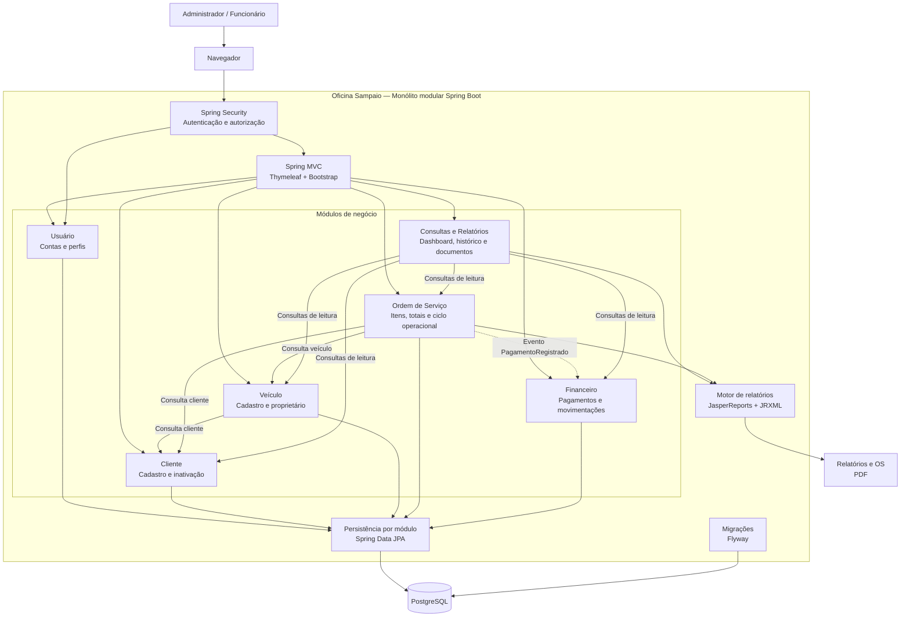
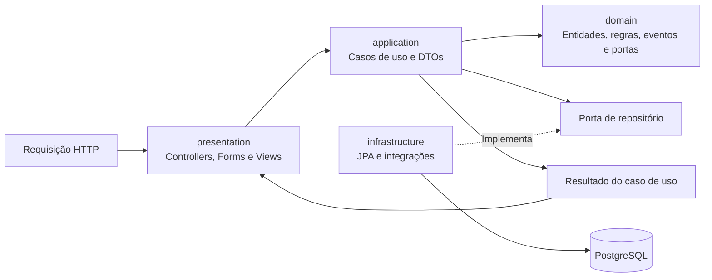
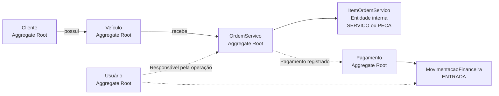
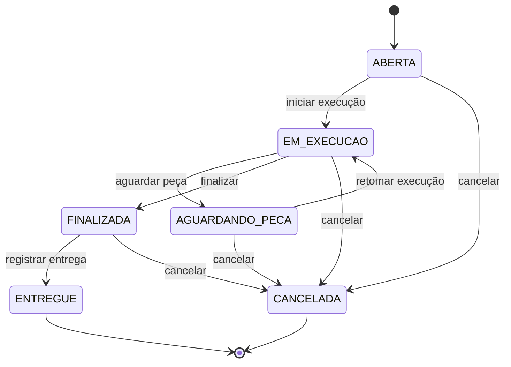
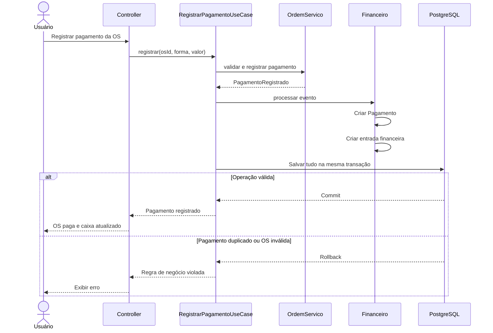
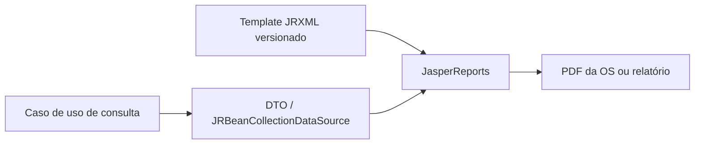

# Arquitetura do Oficina Sampaio

## Visão geral

O Oficina Sampaio será construído como um monólito modular em Spring Boot. Cada
área de negócio mantém seu domínio, seus casos de uso, sua persistência e sua
interface web, compartilhando inicialmente uma única aplicação e um banco
PostgreSQL.



## Estrutura interna dos módulos



A direção permitida das dependências é:

```text
presentation -> application -> domain
infrastructure -> portas do domain/application
```

O domínio não conhece controllers, HTML, Thymeleaf ou detalhes do PostgreSQL.
Nenhum módulo acessa diretamente o repositório interno de outro módulo. A
integração acontece por casos de uso públicos, consultas públicas ou eventos.

## Agregados iniciais



- `ItemOrdemServico` pertence à `OrdemServico`, diferencia serviço e peça pelo
  tipo e não possui repositório próprio.
- Pagamento é separado do estado operacional da ordem.
- Movimentações financeiras formam o histórico do caixa.
- O saldo é calculado como entradas menos saídas; não existe um saldo mutável
  armazenado em uma entidade `Caixa`.
- Registros com histórico são inativados ou cancelados, não removidos
  fisicamente.

## Ciclo da ordem de serviço

Estados operacionais:



A execução só começa quando existe ao menos um item. Serviços e peças podem ser
lançados enquanto a ordem não está finalizada, ou seja, em `ABERTA`,
`EM_EXECUCAO` e `AGUARDANDO_PECA` — assim a peça recebida durante a espera entra
no total antes do fechamento. `FINALIZADA` encerra o valor da ordem, e
`ENTREGUE` e `CANCELADA` são estados terminais.

O cancelamento é restrito ao perfil `ADMIN`; as demais transições estão
disponíveis para qualquer usuário autenticado. A restrição é aplicada no
servidor e também esconde o botão na tela de detalhe.

Violações dessas regras são sinalizadas pelo domínio com `RegraNegocioException`
e chegam ao usuário como mensagem na própria tela. Como o agregado usa lock
otimista, uma alteração concorrente é reportada como conflito, sem perder a
versão já gravada.

O pagamento possui estado financeiro próprio (`PENDENTE` ou `PAGA`). Uma ordem
cancelada não pode receber pagamento.

## Registro de pagamento



Pagamento, atualização da ordem e entrada financeira devem ser persistidos na
mesma transação. Uma restrição única no banco deve impedir que o mesmo pagamento
gere mais de uma movimentação.

## Relatórios e documentos

Relatórios gerenciais e a impressão da ordem de serviço serão gerados com
JasperReports. Os layouts ficam versionados como templates `JRXML` no módulo de
relatórios e são compilados para execução pela aplicação.



O domínio não conhece JasperReports. Casos de uso preparam os dados de leitura,
enquanto a infraestrutura de relatórios seleciona o template, preenche os
parâmetros e exporta o documento. Essa fronteira permite testar as consultas sem
depender da renderização e validar os templates separadamente.

## Pacotes

```text
br.com.oficinasampaio
├── shared
│   ├── domain
│   ├── infrastructure
│   └── presentation
├── usuario
│   ├── domain
│   ├── application
│   ├── infrastructure
│   └── presentation
├── cliente
│   ├── domain
│   ├── application
│   ├── infrastructure
│   └── presentation
├── veiculo
│   ├── domain
│   ├── application
│   ├── infrastructure
│   └── presentation
├── ordemservico
│   ├── domain
│   ├── application
│   ├── infrastructure
│   └── presentation
├── financeiro
│   ├── domain
│   ├── application
│   ├── infrastructure
│   └── presentation
├── relatorio
│   ├── application
│   ├── infrastructure
│   └── presentation
└── security
```

Como compromisso de DDD Lite, as entidades de domínio podem receber anotações
JPA inicialmente. Os repositórios continuam expostos como portas, enquanto a
implementação Spring Data permanece na infraestrutura. DTOs são usados nas
fronteiras da aplicação e não substituem as entidades dentro do domínio.

## Estado da implementação

Implementado nas quatro primeiras fatias verticais:

- fundação Spring Boot 4.1 e Java 21;
- módulos `cliente` e `veiculo` nas quatro camadas;
- contratos públicos entre Veículo e Cliente;
- PostgreSQL 17, Flyway e Docker Compose;
- interfaces MVC/Thymeleaf de cadastro e listagem para os dois módulos;
- módulo `usuario` com perfis `ADMIN` e `FUNCIONARIO`;
- autenticação por formulário, senhas BCrypt e autorização de rotas;
- gestão de usuários restrita a administradores e bootstrap do primeiro acesso;
- módulo `ordemservico` com abertura para cliente e veículo ativos;
- itens de serviço e peça internos ao agregado, com quantidades e valores positivos;
- totais monetários derivados no domínio e consulta detalhada pela interface web;
- persistência das ordens e seus itens pela migration Flyway `V3`;
- ciclo operacional completo da ordem, com ações válidas expostas pela aplicação;
- itens lançáveis até a finalização e cancelamento restrito ao administrador;
- persistência otimista das mudanças de estado e controles correspondentes na interface web;
- navegação e telas de stand-by para Pagamentos, Financeiro e Relatórios, servidas
  temporariamente por `shared.presentation` até que cada módulo assuma sua rota;
- testes de domínio, casos de uso, HTTP e persistência real com Testcontainers.

Ainda planejado no desenho, mas não implementado: pagamento, `financeiro`,
relatórios JasperReports e seus templates `JRXML`. Até essas fatias serem
entregues, as respectivas rotas exibem “Módulo em construção”.
