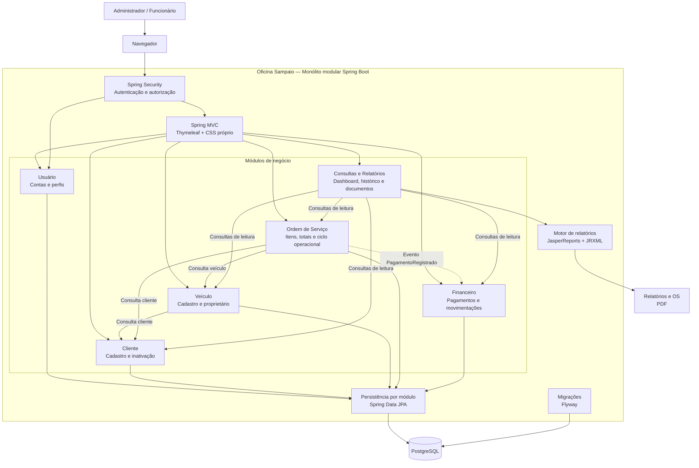
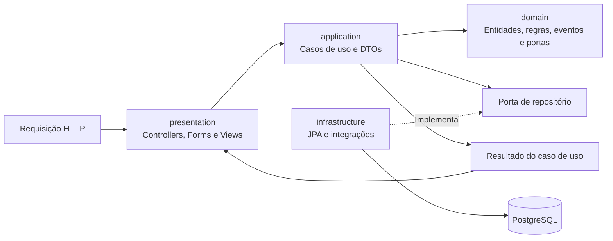
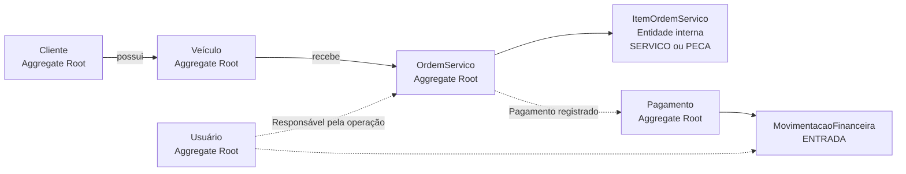
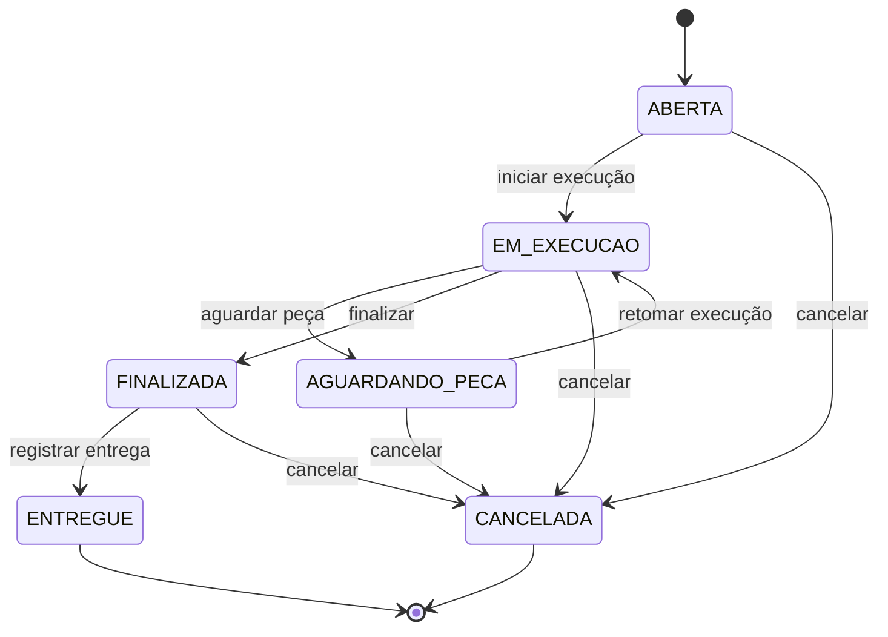
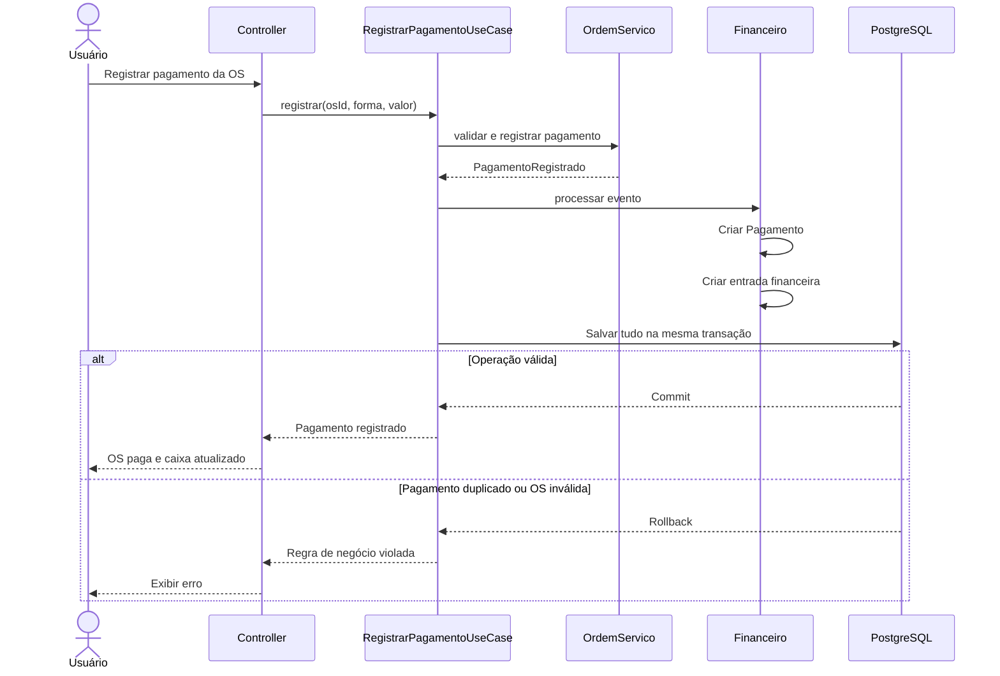
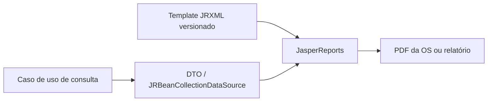

# Arquitetura do Oficina Sampaio

## Visão geral

O Oficina Sampaio será construído como um monólito modular em Spring Boot. Cada
área de negócio mantém seu domínio, seus casos de uso, sua persistência e sua
interface web, compartilhando inicialmente uma única aplicação e um banco
PostgreSQL.



## Estrutura interna dos módulos



A direção permitida das dependências é:

```text
presentation -> application -> domain
infrastructure -> portas do domain/application
```

O domínio não conhece controllers, HTML, Thymeleaf ou detalhes do PostgreSQL.
Nenhum módulo acessa diretamente o repositório interno de outro módulo. A
integração acontece por casos de uso públicos, consultas públicas ou eventos.

## Agregados iniciais



- `ItemOrdemServico` pertence à `OrdemServico`, diferencia serviço e peça pelo
  tipo e não possui repositório próprio.
- Pagamento é separado do estado operacional da ordem.
- Movimentações financeiras formam o histórico do caixa.
- O saldo é calculado como entradas menos saídas; não existe um saldo mutável
  armazenado em uma entidade `Caixa`.
- Registros com histórico são inativados ou cancelados, não removidos
  fisicamente.

## Ciclo da ordem de serviço

Estados operacionais:



A execução só começa quando existe ao menos um item. Serviços e peças podem ser
lançados enquanto a ordem não está finalizada, ou seja, em `ABERTA`,
`EM_EXECUCAO` e `AGUARDANDO_PECA` — assim a peça recebida durante a espera entra
no total antes do fechamento. `FINALIZADA` encerra o valor da ordem, e
`ENTREGUE` e `CANCELADA` são estados terminais.

A retirada de um item vale na mesma janela do lançamento: o que foi cadastrado
por engano pode ser removido enquanto a ordem aceita alteração de itens, e
deixa de existir em `FINALIZADA`, `ENTREGUE` e `CANCELADA`, quando o valor da
ordem já está fechado. Uma ordem que já saiu de `ABERTA` não pode ficar sem
nenhum item: esvaziá-la produziria um estado que a própria transição de início
de execução não permitiria alcançar. Para trocar o único item de uma ordem em
andamento, lança-se o correto antes de remover o errado. Na tela, a remoção
pede confirmação numa caixa do próprio sistema visual; a regra, porém, vive no
domínio — a confirmação é conveniência, não controle.

O cancelamento é restrito ao perfil `ADMIN`; as demais transições estão
disponíveis para qualquer usuário autenticado. A restrição é aplicada no
servidor e também esconde o botão na tela de detalhe.

A mesma divisão vale para o dinheiro: registrar pagamento e consultar o que falta
receber é trabalho de balcão, disponível a qualquer usuário autenticado, enquanto
a posição do caixa e o lançamento de saída ficam sob `/financeiro/**`, restrito a
`ADMIN`. A entrada de menu segue a regra da rota, para o funcionário não bater em
uma tela proibida.

Violações dessas regras são sinalizadas pelo domínio com `RegraNegocioException`
e chegam ao usuário como mensagem na própria tela. Como o agregado usa lock
otimista, uma alteração concorrente é reportada como conflito, sem perder a
versão já gravada.

O pagamento possui estado financeiro próprio (`PENDENTE` ou `PAGA`), guardado na
ordem ao lado do estado operacional: um carro pode estar entregue com a conta em
aberto, e o contrário também acontece.

A janela do pagamento é o espelho da janela dos itens. Enquanto a ordem aceita
alteração de itens o total ainda pode crescer, então o pagamento é recusado com
`RegraNegocioException`; ele só é aceito em `FINALIZADA` e `ENTREGUE`, que são os
estados em que o valor está fechado. Uma ordem cancelada não recebe pagamento em
nenhuma hipótese. O valor chega da interface apenas para ser conferido contra o
total do agregado — divergência é recusada em vez de gerar uma entrada de caixa
que não corresponde à ordem — e o que vale no evento é sempre o total calculado
pelo domínio. Na tela, o valor não é digitado: vai no botão e num campo oculto.

## Registro de pagamento



Pagamento, atualização da ordem e entrada financeira são persistidos na mesma
transação. O evento é publicado com `ApplicationEventPublisher` e ouvido de forma
síncrona pelo financeiro: o ouvinte roda na thread e na transação de quem
publicou, então recusa do caixa derruba a operação inteira — ordem paga sem
entrada no caixa seria dinheiro que ninguém consegue explicar.

Duas restrições únicas no banco sustentam isso quando a checagem do caso de uso
não basta, por exemplo em dois cliques simultâneos: uma ordem admite um único
pagamento (`uk_pagamentos_ordem`) e um pagamento gera uma única movimentação
(`uk_movimentacoes_pagamento`).

O contrato entre os dois módulos mora em `shared.domain`: `FormaPagamento` e o
evento `PagamentoRegistrado`. Assim a ordem de serviço não importa nada de
`financeiro`, e `financeiro` não importa nada de `ordemservico` — nenhum dos dois
depende do outro para compilar. Do outro lado, o financeiro publica
`PagamentoQueries` como consulta pública, e é por ela que a tela da ordem mostra
como e quando a conta foi paga.

## Relatórios e documentos

Relatórios gerenciais e a impressão da ordem de serviço serão gerados com
JasperReports. Os layouts ficam versionados como templates `JRXML` no módulo de
relatórios e são compilados para execução pela aplicação.



O domínio não conhece JasperReports. Uma única classe da infraestrutura menciona
a ferramenta; para o resto do sistema existe apenas a porta `MotorDeRelatorio`,
que recebe o template, os parâmetros e as linhas. Escolher o template é o mesmo
gesto de devolver o nome de uma página HTML — quem imprime é apresentação, e por
isso a montagem dos dados de tela e de papel fica lado a lado.

As linhas chegam como `record`, que é o que a aplicação já produz, e o motor as
traduz para mapa. A acomodação é deliberada e local: o JasperReports leria
propriedades de JavaBean (`getValor()`) e um record expõe `valor()`. Manter
classes de linha só para agradar a ferramenta espalharia a exigência dela pelo
sistema; assim ela fica presa em quem a conhece. O nome do componente do record é
o nome do campo no JRXML.

Compilar JRXML é caro, então cada template é compilado na primeira emissão e
fica guardado. O locale do relatório é fixado em pt-BR: os padrões numéricos são
resolvidos pelo locale, e sem fixá-lo o mesmo total sairia `1.849,50` em uma
máquina e `1,849.50` em outra.

Dois cuidados que o desenho não revela e a ferramenta não avisa: texto que não
cabe na altura declarada do elemento **não é impresso** — não é cortado nem
reduzido, simplesmente não aparece — e por isso os testes conferem o texto de
dentro do PDF, não apenas se o arquivo é um PDF válido. Foi o que pegou a placa e
o total da ordem faltando no papel.

Documento e relatório são coisas diferentes, e a autorização segue essa
distinção. A via impressa da ordem é documento de atendimento, servida em
`/documentos/ordens-servico/{id}` para qualquer usuário autenticado. Faturamento
e caixa são gestão, servidos em `/relatorios/**` e restritos a `ADMIN`.

## Pacotes

```text
br.com.oficinasampaio
├── shared
│   ├── domain
│   ├── infrastructure
│   └── presentation
├── usuario
│   ├── domain
│   ├── application
│   ├── infrastructure
│   └── presentation
├── cliente
│   ├── domain
│   ├── application
│   ├── infrastructure
│   └── presentation
├── veiculo
│   ├── domain
│   ├── application
│   ├── infrastructure
│   └── presentation
├── ordemservico
│   ├── domain
│   ├── application
│   ├── infrastructure
│   └── presentation
├── financeiro
│   ├── domain
│   ├── application
│   ├── infrastructure
│   └── presentation
├── relatorio
│   ├── application
│   ├── infrastructure
│   └── presentation
└── security
```

Como compromisso de DDD Lite, as entidades de domínio podem receber anotações
JPA inicialmente. Os repositórios continuam expostos como portas, enquanto a
implementação Spring Data permanece na infraestrutura. DTOs são usados nas
fronteiras da aplicação e não substituem as entidades dentro do domínio.

## Estado da implementação

Implementado nas seis fatias verticais:

- fundação Spring Boot 4.1 e Java 21;
- módulos `cliente` e `veiculo` nas quatro camadas;
- contratos públicos entre Veículo e Cliente;
- PostgreSQL 17, Flyway e Docker Compose;
- interfaces MVC/Thymeleaf de cadastro e listagem para os dois módulos;
- módulo `usuario` com perfis `ADMIN` e `FUNCIONARIO`;
- autenticação por formulário, senhas BCrypt e autorização de rotas;
- gestão de usuários restrita a administradores e bootstrap do primeiro acesso;
- módulo `ordemservico` com abertura para cliente e veículo ativos;
- itens de serviço e peça internos ao agregado, com quantidades e valores positivos;
- totais monetários derivados no domínio e consulta detalhada pela interface web;
- persistência das ordens e seus itens pela migration Flyway `V3`;
- ciclo operacional completo da ordem, com ações válidas expostas pela aplicação;
- itens lançáveis e removíveis até a finalização, e cancelamento restrito ao administrador;
- persistência otimista das mudanças de estado e controles correspondentes na interface web;
- pagamento no agregado da ordem, com estado financeiro próprio e janela igual à
  dos itens, publicando `PagamentoRegistrado` na mesma transação;
- módulo `financeiro` nas quatro camadas, com `Pagamento`, `MovimentacaoFinanceira`,
  saldo derivado e lançamento de saída;
- restrições únicas da migration `V4` para um pagamento por ordem e uma
  movimentação por pagamento;
- telas de Pagamentos (contas em aberto e recebidos) e Financeiro (posição,
  extrato e saída), com o caixa restrito ao administrador;
- módulo `relatorio` com o motor JasperReports isolado atrás de uma porta;
- três templates `JRXML` versionados: via impressa da ordem, faturamento e caixa;
- impressão da OS em PDF pelo balcão e fechamentos por período para o administrador;
- painel gerencial com ordens por estado, contas em aberto e posição do caixa;
- consultas por período no financeiro, com `Periodo` convertendo dias em instantes;
- testes de domínio, casos de uso, HTTP, conteúdo dos PDFs e persistência real
  com Testcontainers.

O desenho está implementado por inteiro; não há mais rota exibindo “Módulo em
construção”. O que segue em aberto são complementos dos módulos existentes:
inativação de cliente, veículo e usuário — o domínio já sabe fazer, falta a porta
de entrada — e edição dos cadastros.
